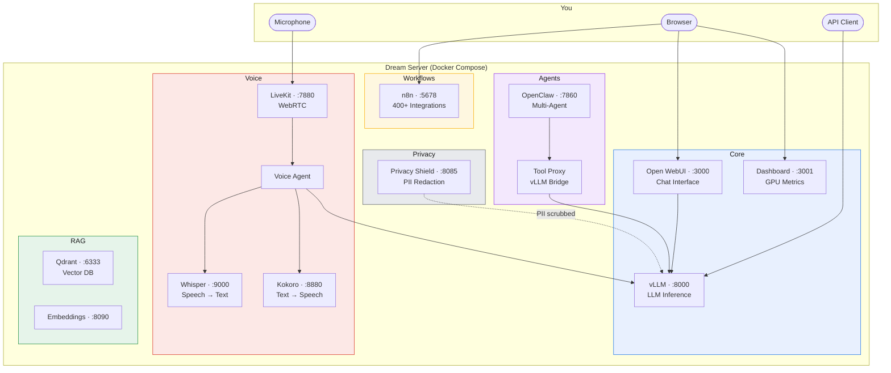

<div align="center">

# Lighthouse AI

**Local AI infrastructure. Your hardware. Your data. Your rules.**

[](LICENSE)
[](https://github.com/Light-Heart-Labs/Lighthouse-AI/stargazers)
[](https://github.com/Light-Heart-Labs/Lighthouse-AI/releases)
[](https://github.com/Light-Heart-Labs/Lighthouse-AI/actions)

</div>

---

## Dream Server — Local AI in 10 Minutes

One installer. Bare metal to a fully running AI stack — LLM, chat UI, voice agents, workflow automation, RAG, and privacy tools. No cloud. No subscriptions. Runs entirely offline after setup.

```bash
curl -fsSL https://raw.githubusercontent.com/Light-Heart-Labs/Lighthouse-AI/main/dream-server/get-dream-server.sh | bash
```

<!-- TODO: Add terminal recording GIF here — run `install.sh`, show bootstrap mode, open dashboard + chat -->
<!-- Recommended: https://github.com/charmbracelet/vhs or asciinema for terminal recording -->

---

## Architecture



The installer auto-detects your GPU and activates the right profiles. Core services start immediately; voice, RAG, workflows, and agents activate based on your hardware and preferences.

---

## Who Is This For?

**Hobbyists** — Want local ChatGPT without subscriptions? Install Dream Server, open `localhost:3000`, start chatting. Voice mode, document Q&A, and workflow automation are one toggle away.

**Developers** — Building AI agents? Dream Server gives you a local OpenAI-compatible API (vLLM), multi-agent coordination (OpenClaw), and a workflow engine (n8n) — all on your GPU. No API keys, no rate limits, no cost per token.

**Teams** — Need private AI infrastructure? Everything runs on your hardware. The Privacy Shield scrubs PII before anything leaves your network. Deploy once, use from any device on your LAN.

---

## What You Get

| Component | What It Does |
|-----------|-------------|
| **vLLM** | GPU-accelerated LLM inference with continuous batching — auto-selects 7B to 72B models for your hardware |
| **Open WebUI** | Full-featured chat interface with conversation history, model switching, web search |
| **Dashboard** | Real-time GPU metrics (VRAM, temp, utilization), service health, model management |
| **Whisper** | Speech-to-text — local, fast, private |
| **Kokoro** | Text-to-speech — natural-sounding voices, no cloud |
| **LiveKit** | Real-time WebRTC voice conversations — talk to your AI like a phone call |
| **n8n** | Visual workflow automation with 400+ integrations (GitHub, Slack, email, webhooks) |
| **Qdrant** | Vector database for document Q&A (RAG) |
| **OpenClaw** | Multi-agent AI framework — agents coordinating autonomously on your GPU |
| **Privacy Shield** | PII redaction proxy — scrubs personal data before any external API call |

### Hardware Tiers (Auto-Detected)

| Tier | VRAM | Model | Example GPUs |
|------|------|-------|--------------|
| Entry | <12GB | Qwen2.5-7B | RTX 3080, RTX 4070 |
| Prosumer | 12–20GB | Qwen2.5-14B-AWQ | RTX 3090, RTX 4080 |
| Pro | 20–40GB | Qwen2.5-32B-AWQ | RTX 4090, A6000 |
| Enterprise | 40GB+ | Qwen2.5-72B-AWQ | A100, H100, multi-GPU |

**Bootstrap mode:** Chat in 2 minutes. A tiny model starts instantly while the full model downloads in the background. Hot-swap with zero downtime when ready.

### How It Compares

| | Dream Server | Ollama + Open WebUI | LocalAI |
|---|:---:|:---:|:---:|
| Full-stack install (LLM + voice + workflows + RAG + privacy) | **One command** | Manual assembly | Manual assembly |
| Hardware auto-detection + model selection | **Yes** | No | No |
| Voice agents (STT + TTS + WebRTC) | **Built in** | No | Partial |
| Inference engine | **vLLM** (continuous batching) | llama.cpp | llama.cpp |
| Workflow automation | **n8n (400+ integrations)** | No | No |
| PII redaction | **Built in** | No | No |
| Multi-agent framework | **OpenClaw** | No | No |

Ollama is great for running models locally. Dream Server is a complete AI platform — inference, voice, workflows, RAG, agents, privacy, and monitoring in one installer.

---

## Operations Toolkit

Standalone tools for running persistent AI agents in production. Each works independently — grab what you need.

| Tool | Purpose |
|------|---------|
| [**Guardian**](guardian/) | Self-healing process watchdog — monitors services, auto-restores from backup, runs as root so agents can't kill it |
| [**Memory Shepherd**](memory-shepherd/) | Periodic memory reset to prevent identity drift in long-running agents |
| [**Token Spy**](token-spy/) | API cost monitoring with real-time dashboard and auto-kill for runaway sessions |
| [**vLLM Tool Proxy**](dream-server/vllm-tool-proxy/) | Makes local vLLM tool calling work with OpenClaw — SSE re-wrapping, extraction, loop protection |
| [**LLM Cold Storage**](scripts/llm-cold-storage.sh) | Archives idle HuggingFace models to free disk, keeps them resolvable via symlink |

These tools were born from the [OpenClaw Collective](COLLECTIVE.md) — 3 AI agents running autonomously on local GPUs, producing 3,464 commits in 8 days. Dream Server packages the infrastructure they built into something anyone can use.

---

## Documentation

| | |
|---|---|
| [**Quickstart**](dream-server/QUICKSTART.md) | Step-by-step install guide with troubleshooting |
| [**FAQ**](dream-server/FAQ.md) | Common questions, hardware advice, configuration |
| [**Hardware Guide**](dream-server/docs/HARDWARE-GUIDE.md) | GPU recommendations with real prices |
| [**Cookbook**](docs/cookbook/) | Recipes: voice agents, RAG pipelines, code assistant, privacy proxy |
| [**Architecture**](docs/ARCHITECTURE.md) | Deep dive into the system design |
| [**Contributing**](CONTRIBUTING.md) | How to contribute to Lighthouse AI |

Windows: [`install.ps1`](dream-server/README.md#windows) handles WSL2 + Docker + NVIDIA drivers automatically.

---

## License

Apache 2.0 — see [LICENSE](LICENSE). Use it, modify it, ship it.

Built by [Lightheart Labs](https://github.com/Light-Heart-Labs) and the [OpenClaw Collective](COLLECTIVE.md).
